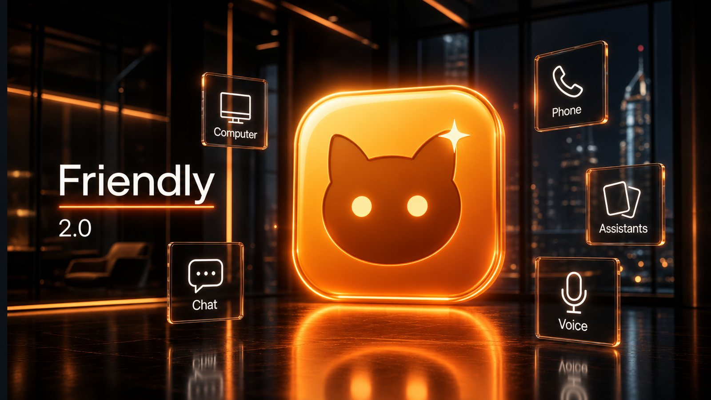
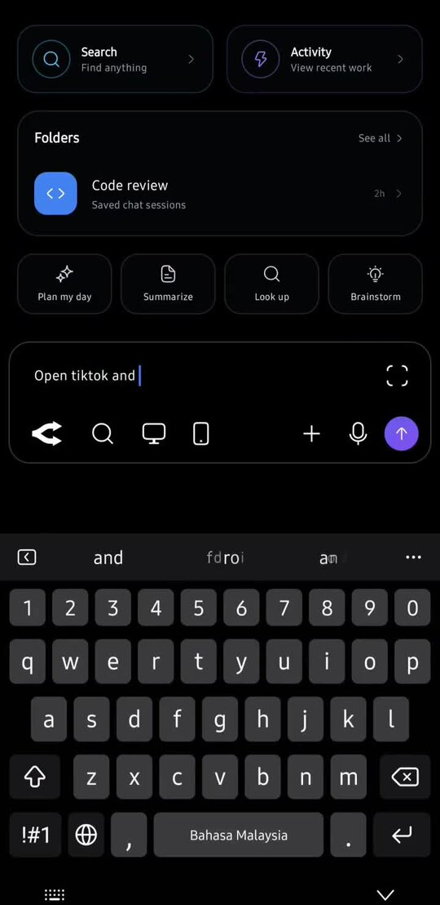
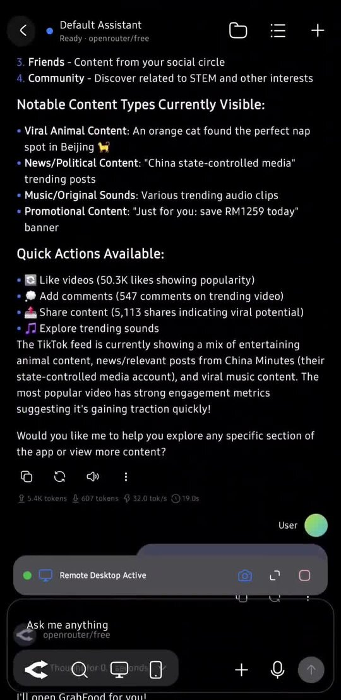
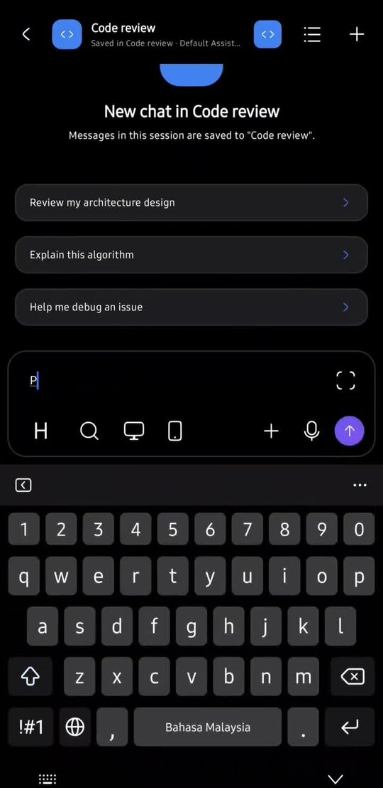

<div align="center">
  
  <h1>Friendly 2.0</h1>
  <p><strong>Your Android AI Catsistant that chats, acts on your phone, and controls a self-hosted Linux desktop.</strong></p>
  <p>
    <a href="LICENSE"></a>
    
    
    
  </p>
</div>

<p align="center">
  
</p>

<p align="center">
  <a href="https://x.com/cryptgreg/status/2105931441360253273">Watch a community review on X</a>
  ·
  <a href="https://github.com/jimskin03/friendly/releases">Releases</a>
  ·
  <a href="host/SETUP_UBUNTU.md">Computer host setup</a>
</p>

---

## What is Friendly?

Friendly (a Rikka Hub fork) is an open-source **Android AI Catsistant** (Kotlin, Material 3) that goes beyond chat. Bring your own model providers, organize conversations, and optionally let the assistant:

- **Automate your phone** — inspect the screen, tap, swipe, type, and launch apps (TikTok, Grab, and more) via an Accessibility service you control
- **Control a remote Linux computer** — connect over a private network (Tailscale recommended) to a self-hosted Control API, live desktop stream, and MCP tools
- **Self-correct** — when a phone or desktop action fails, the agent can re-inspect the UI and retry with better coordinates or steps

You choose the models, search backends, and whether phone automation or Computer control is enabled. Secrets stay in app settings and host `.env` — never in the repo.

---

## Screenshots

| Home & tools | Inspect Screen | Folders |
|:---:|:---:|:---:|
|  |  |  |

More assets live under [`docs/img/`](docs/img/) and [`docs/screenshots/`](docs/screenshots/). Drop additional Play Store frames into `docs/screenshots/` (see that folder’s README).

Inline demo:

<div align="center">
  <video
    src="docs/video/friendly-demo.mp4"
    width="280"
    controls
    playsinline
    preload="metadata"
    title="Friendly 2.0 promotional demo"
  >
    Friendly 2.0 promotional demo
  </video>
  <p><a href="docs/video/friendly-demo.mp4">▶ Watch the 20-second Friendly 2.0 showcase (MP4)</a></p>
</div>

---

## Features

### Chat & assistants
- **Bring your own providers:** OpenAI, Gemini, DeepSeek, OpenRouter, Ollama (local or cloud), xAI, plus custom OpenAI-compatible endpoints
- **Rich conversations:** branching/regeneration, markdown, code highlighting, LaTeX, tables, image & document attachments
- **Organize:** dashboards, folders, labels, folder-specific lists
- **Custom assistants:** prompts, memory, quick messages, skills, and per-assistant tools
- **Search:** Bing, Tavily, Exa, SearXNG, Brave, Ollama, Perplexity, Firecrawl, Grok, and custom JS search
- **MCP:** connect Model Context Protocol servers (including OAuth where supported)
- **Workspace tools:** isolated workspaces with file and terminal access for agent tasks
- **Voice:** ASR input and optional TTS replies when providers are configured
- **Image generation** when a compatible provider/model is set

Provider availability depends on the service, model, region, and credentials you configure.

#### Ollama (local or cloud)

Built-in **Ollama** uses the OpenAI-compatible client (`/v1/chat/completions`).

- **Local:** keep Base URL `http://localhost:11434/v1` (or your LAN/Tailscale host). API key is optional — local Ollama ignores it. On an Android emulator, use `http://10.0.2.2:11434/v1` to reach the host machine.
- **Cloud:** set Base URL to `https://ollama.com/v1` and paste an [Ollama Cloud API key](https://ollama.com/settings/keys).

Then add models by ID (e.g. `llama3.2` locally, or a cloud model id from Ollama) under the provider’s model list.

### Phone automation
- Accessibility-backed **Phone Automation** local tools (enable per assistant)
- **Inspect Screen** — analyze layout, buttons, and text on the current UI
- Tap / swipe / type / press keys / launch apps / screenshot
- Designed so the model can recover when a tap misses: inspect again, then retry

> Phone automation requires enabling Friendly’s accessibility service in Android Settings. Only grant this if you trust the app; you can revoke it anytime.

### Computer / remote desktop (self-hosted)
- In-app **Computer** control: live stream, trackpad-style interaction, keyboard, Chromium/terminal quick actions
- Host **Control API** on port **8787** (screenshot, click, type, hotkey, browser open, stream start/stop)
- Host **MCP** at `/mcp` for agent desktop tools
- Configure in **Settings → Preferences → Network** → **Desktop / Computer control** (Base URL + API token)
- Prefer **Tailscale** (or another private mesh) between phone and host — do not expose raw VNC or unauthenticated API to the public internet

Full host docs: [`host/README.md`](host/README.md) · [`host/SETUP_UBUNTU.md`](host/SETUP_UBUNTU.md)

---

## Requirements

| | |
|---|---|
| **Android** | 8.0 (API 26) or newer · `targetSdk` 37 |
| **Application ID** | `friendly.cryptgregresearch.org` (debug builds use `.debug` → `friendly.cryptgregresearch.org.debug`) |
| **Version** | 3.0.0 (`versionCode` 300) |
| **Build machine** | JDK 17, Android SDK Platform 37, NDK `28.2.13676358`, Node.js 22 + pnpm 11 |

### Permissions (honest summary)

Declared in the app manifest; optional features only work when you grant the matching permission:

| Permission / access | Why |
|---|---|
| Internet / local network | Model APIs, search, MCP, Computer host |
| Microphone | Speech input |
| Camera | Scanning / capture features |
| Notifications | Generation / foreground service updates |
| Foreground services | Long-running chat generation / web server |
| Calendar (read/write) | Calendar tools when enabled |
| Usage access | Screen-time style features when enabled (**nightly** flavor only) |
| Storage (legacy, max SDK 28) | Older Android file access |
| **Accessibility service** | Phone Automation (inspect / gestures) — user must enable explicitly (**nightly** flavor only; not registered in Play builds) |
| Overlay / phone call permissions | Mini indicator + cellular place/answer call paths (**nightly** only) |

Core chat works without accessibility, camera, or calendar. Review each provider’s privacy policy before sending prompts or attachments. The **play** product flavor omits or gates policy-risky phone automation, overlay, call, and usage-stats features for store submission.

---

## Quick start (end users)

1. Install **3.0.0** from the [nightly release](https://github.com/jimskin03/friendly/releases/tag/nightly) (Play Store listing TBD) or [build from source](#build-from-source). Prefer `app-nightly-arm64-v8a-release.apk` on most phones.
2. Open Friendly → **Settings → Providers** → add a provider and API key.
3. Pick a model and start chatting or create an assistant.
4. Optional:
   - **Phone Automation:** Android Settings → Accessibility → enable Friendly → in the assistant, enable **Phone Automation** under Local Tools.
   - **Computer:** set up the [Linux host](#self-hosted-computer-host), then **Settings → Preferences → Network** → Desktop / Computer control → Base URL + token → Test Connection.
5. Never paste API keys, host `API_TOKEN`s, or private Tailscale URLs into issues or screenshots.

---

## Self-hosted Computer host

The optional Linux companion runs a headless desktop (Xvfb + Openbox + Chromium) and a FastAPI Control API.

### Recommended path (Ubuntu)

```bash
git clone --branch friendly-2.0 --recurse-submodules https://github.com/jimskin03/friendly.git
cd friendly/host
sudo ./scripts/setup-ubuntu-headless.sh
```

The script installs packages, creates a venv, generates a strong `API_TOKEN` into `.env` / `/etc/friendly-host.env`, and starts systemd units. Copy the printed **Base URL** and **token** into the Android app — do not commit `.env`.

### Manual / lab quick start

```bash
cd friendly/host
cp .env.example .env   # set a long random API_TOKEN
./scripts/bootstrap-host.sh
./scripts/start-idle-stack.sh
source agent/.venv/bin/activate
cd agent
set -a && source ../.env && set +a
uvicorn app.main:app --host "${API_HOST:-127.0.0.1}" --port "${API_PORT:-8787}"
```

Smoke tests: `./scripts/smoke-test-api.sh`, `./scripts/smoke-test-mcp.sh`, `./scripts/smoke-test-stream.sh`.

### Networking (Tailscale first)

Friendly’s host is meant for a **private network**:

1. Install [Tailscale](https://tailscale.com/) on the Ubuntu host and on the Android phone (same account).
2. On the host: `tailscale ip -4` → use `http://<tailscale-ip>:8787` as the Control API Base URL.
3. Keep `API_HOST=127.0.0.1` where possible and reach the API via Tailscale; never publish raw VNC (ports 5999/6099 stay localhost + serve/tunnel).
4. Alternatives (Cloudflare Tunnel, reverse proxy) are documented in [`host/SETUP_UBUNTU.md`](host/SETUP_UBUNTU.md). Prefer authenticated/private access over open public ports.

### Configure the Android app

1. **Settings → Preferences → Network** → **Desktop / Computer control**
2. **Base URL:** e.g. `http://100.x.y.z:8787` (Tailscale)
3. **API token:** same value as host `API_TOKEN` (Bearer)
4. **Test Connection**, then use the **Computer** control in chat
5. Per assistant: **Local Tools → Desktop Control (Linux VM)** to allow agent-driven click/type/hotkey/browser tools

Optional MCP registration for the host: name `friendly-desktop`, Streamable HTTP URL `http://<host>:8787/mcp`, header `Authorization: Bearer <API_TOKEN>`.

---

## Architecture (brief)

```
┌──────────────────────────┐         private mesh (Tailscale)        ┌────────────────────────────┐
│  Friendly (Android)      │ ─────────────────────────────────────── │  Friendly Host (Linux)     │
│  • Chat / assistants     │   HTTPS/HTTP Bearer API_TOKEN           │  Xvfb :99 + Openbox        │
│  • Phone Automation      │   Control API :8787  /mcp  /v1/*        │  Chromium + xdotool        │
│  • Computer stream UI    │   on-demand noVNC viewer (JWT TTL)      │  FastAPI agent + stream    │
└──────────────────────────┘                                         └────────────────────────────┘
```

- **Phone path:** Accessibility service → local tools (`phone_inspect_screen`, click, swipe, …) → model loop can re-inspect after failures.
- **Desktop path:** `DesktopControlClient` + local desktop tools → host Control API; live viewer is a human overlay, not the only control plane.
- **Data:** prompts go to the providers you configure; desktop pixels stay on your host unless you or the agent send screenshots into a chat that uses a cloud model.

See [`host/docs/architecture.md`](host/docs/architecture.md) for host defaults.

### Project layout

| Path | Role |
|---|---|
| `app/` | Android app (Compose UI, settings, phone & desktop clients) |
| `ai/` | Model/provider abstractions and tools |
| `search/`, `speech/`, `workspace/` | Search, ASR/TTS, workspace agents |
| `web/`, `web-ui/` | Embedded web server + bundled UI |
| `host/` | Self-hosted Linux Control API, MCP, stream stack |
| `docs/` | Icons, screenshots, references |

---

## Build from source

```bash
git clone --branch friendly-2.0 --recurse-submodules https://github.com/jimskin03/friendly.git
cd friendly

corepack enable
corepack prepare pnpm@11 --activate
cd web-ui && pnpm install --frozen-lockfile && cd ..

# Nightly (full features: phone automation, overlay, cellular calls, LAN cleartext)
./gradlew :app:assembleNightlyDebug
# Play-safer (gates a11y phone automation, overlay, call APIs, usage-stats screen time; cleartext off)
./gradlew :app:assemblePlayDebug
```

APKs land under `app/build/outputs/apk/<nightly|play>/debug/`. For signed nightly/release builds use `scripts/build.sh` or `scripts\build.ps1` (see [docs/BUILD.md](docs/BUILD.md)); CI and releases are described in [docs/RELEASE.md](docs/RELEASE.md). Both flavors share `applicationId` `friendly.cryptgregresearch.org` — Play and sideload builds cannot both be installed with different signing under the same ID.

Release builds need your own signing config (`keystore.properties`, see `keystore.properties.example`) — keep keystores, `local.properties`, and `google-services.json` out of git.

### Play bundle and paid themes

The **play** flavor sells the four paid themes through Google Play Billing (one non-consumable in-app product per theme, plus a bundle):

| Theme | Product ID |
|---|---|
| Cute Minimal | `theme_cute_minimal` |
| Cozy Night | `theme_cozy_night` |
| Playful Doodle | `theme_playful_doodle` |
| Glass Frost | `theme_glass_frost` |
| All four | `theme_pack_all` |

The **nightly** flavor has no Play billing and keeps the themes unlocked (`BuildConfig.UNLOCK_PAID_THEMES`).

To build an upload bundle, run the **Build** workflow with `channel=release` (see `docs/RELEASE.md`), or locally `scripts/build.sh release --version-code N` (`scripts\build.ps1 release -VersionCode N` on Windows).

### Tests

```bash
./gradlew :app:testNightlyDebugUnitTest
./gradlew test
./gradlew :app:connectedNightlyDebugAndroidTest   # device/emulator required
```

### Troubleshooting

- **SDK not found:** set `ANDROID_HOME` / `sdk.dir` in untracked `local.properties`
- **NDK:** install side-by-side `28.2.13676358`
- **Web UI build:** Node 22 + Corepack pnpm 11 inside `web-ui/`
- **Wrong Java:** `JAVA_HOME` → JDK 21 (the build targets Java 17)
- **Computer offline:** verify Tailscale connectivity, Base URL, and Bearer token; `curl` host `/health` and `/v1/desktop/status`

---

## Privacy & security

- Friendly does **not** ship with a built-in cloud account for your chats; you supply provider keys.
- Phone Accessibility can read UI and inject gestures — enable only when needed; disable when idle.
- Computer host: use a strong `API_TOKEN`, prefer Tailscale/private reachability, bind API to localhost when possible, never expose raw VNC publicly.
- Stream sessions use short-lived viewer JWTs; prefer the in-app Computer button over letting models open tunnels without approval.
- Prompts, attachments, screenshots, and tool payloads may leave the device toward **your chosen** model/search/MCP endpoints — review those policies.
- Do not commit secrets. Host template: [`host/.env.example`](host/.env.example).

A public privacy-policy URL for Play Store listing is not yet published in this repo — add one before store submission.

---

## Status & roadmap

| Area | Status |
|---|---|
| Chat, providers, MCP, workspace | Available on `friendly-2.0` |
| Phone Automation + Inspect Screen | Available (Accessibility) |
| Computer host Control API + MCP + stream | Available under `host/` |
| Play Store publish | In progress — APKs via GitHub Releases for now |
| Hardening (OIDC / Access, UX polish) | Ongoing — see host architecture Phase 4 |

---

## Contributing

Bug reports and PRs are welcome on [`friendly-2.0`](https://github.com/jimskin03/friendly/tree/friendly-2.0).

1. Fork and branch from `friendly-2.0`.
2. Keep secrets out of commits and issue text.
3. Prefer focused PRs; include steps to reproduce for bugs (Friendly version, Android version, non-sensitive logs).

---

## License

Friendly is licensed under the [GNU Affero General Public License v3.0](LICENSE) (AGPL-3.0). Third-party components retain their own licenses.

---

## Links

- X Profiles: [[x.com/cryptgreg](https://x.com/cryptgreg)](https://[x.com/cryptgreg](https://x.com/cryptgreg))
- Repository: [github.com/jimskin03/friendly](https://github.com/jimskin03/friendly)
- Branch: [`friendly-2.0`](https://github.com/jimskin03/friendly/tree/friendly-2.0)
- Host setup: [`host/SETUP_UBUNTU.md`](host/SETUP_UBUNTU.md)
- Issues: [github.com/jimskin03/friendly/issues](https://github.com/jimskin03/friendly/issues)
- Demo / review: [X post by @cryptgreg](https://x.com/cryptgreg/status/2105931441360253273)
