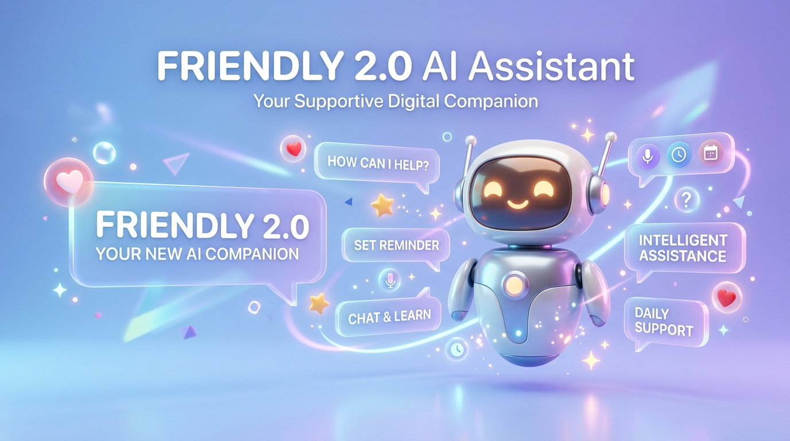

<div align="center">
  
  <h1>Friendly 2.0</h1>
  <p>A modern Android LLM client for conversations, assistants, and agent tools.</p>
</div>

<div align="center">
  
</div>

<div align="center">
  <video
    src="https://github.com/user-attachments/assets/d07b5935-95a5-4b52-8544-d5f4db1e69df"
    width="280"
    controls
    playsinline
    preload="metadata"
    title="Friendly 2.0 screen recording"
  >
    Friendly 2.0 screen recording
  </video>
</div>

## About Friendly

Friendly is an Android chat client that connects to the AI model and search services you choose. It combines a polished Material 3 interface with configurable assistants, conversation organization, MCP tools, and an optional local workspace for agent tasks.

## Features

- **Bring your own model provider:** built-in OpenAI, Gemini, DeepSeek, OpenRouter, Vercel AI Gateway, and xAI configurations, plus custom OpenAI-compatible providers.
- **Rich conversations:** branching and regeneration, markdown and code highlighting, LaTeX, tables, image and document attachments, and conversation history.
- **Organize your chats:** dashboards, folders, labels, and folder-specific conversation lists.
- **Custom assistants:** configure model behavior, prompts, memory, quick messages, skills, and tools.
- **Search integrations:** Bing, Tavily, Exa, SearXNG, Brave, Ollama, Perplexity, Firecrawl, Grok, and custom JavaScript search services.
- **MCP support:** connect Model Context Protocol servers and use their tools in assistant conversations; supported servers can use OAuth authorization.
- **Workspace tools:** create isolated workspaces with agent access to workspace files and terminal tools.
- **Voice features:** speech input and voice conversations with supported ASR providers, with optional spoken replies through a configured TTS provider.
- **Image generation:** available when a compatible provider and model are configured.
- **More extensions:** saved prompts, agent skills, quick messages, and other app tools.

Provider availability and capabilities depend on the service, model, region, and credentials you configure.

## Download

Check [GitHub Releases](https://github.com/jimskin03/friendly/releases) for published APKs. If no suitable build is available, build the app from source using the instructions below.

## First run

1. Install and open Friendly.
2. Go to **Settings → Providers** and configure a model provider and API key.
3. Choose a model, then start a conversation or create an assistant.
4. Configure search, speech, MCP servers, or workspaces from their respective settings and extensions pages when you need them.

API keys and service credentials belong in the app’s settings or your local development environment. Never include them in screenshots, issue reports, or source control.

## Build from source

### Requirements

- JDK 17
- Android SDK Platform 37 (extension level 2)
- Android NDK `28.2.13676358`
- Node.js 22 and pnpm 11 (the embedded web UI is built as part of the Android build)
- Git and an Android device or emulator running Android 8.0 / API 26 or newer to install the app

The repository includes a Gradle wrapper. Android SDK components can be installed through Android Studio’s SDK Manager. Accept the Android SDK licenses before building.

### Clone and build a debug APK

```bash
git clone --branch friendly-2.0 --recurse-submodules https://github.com/jimskin03/friendly.git
cd friendly

# Enable the package manager used to build the bundled web UI.
corepack enable
corepack prepare pnpm@11 --activate
cd web-ui
pnpm install --frozen-lockfile
cd ..

./gradlew :app:assembleDebug
```

The web module runs the `web-ui` production build during Gradle’s `preBuild` phase. Install the generated APK from `app/build/outputs/apk/debug/` with Android Studio or `adb install -r <apk-path>`.

The release application ID is `app.friendly.assistant`; debug builds use the `.debug` suffix so they can be installed alongside a release build. A local `google-services.json` is not required for a debug build; Firebase build plugins are applied when a Google Services configuration is present.

### Tests

```bash
# App JVM unit tests
./gradlew :app:testDebugUnitTest

# JVM unit tests across the Gradle project
./gradlew test

# Instrumentation tests (requires a running emulator or connected device)
./gradlew :app:connectedDebugAndroidTest
```

### Release builds

```bash
./gradlew :app:assembleRelease
```

Release builds require valid signing configuration and a keystore. Keep keystores, signing passwords, API credentials, `local.properties`, and `google-services.json` out of version control.

## Project structure

- `app/` — Android application, Compose UI, navigation, and app-level persistence.
- `ai/` — model/provider abstractions, generation, and AI tools.
- `search/` — search and scraping integrations.
- `speech/` — speech recognition and text-to-speech integrations.
- `workspace/` — workspace file and terminal tooling.
- `document/`, `highlight/` — document handling and syntax highlighting.
- `web/`, `web-ui/` — embedded web server/API and the bundled web interface.
- `oauth/` — OAuth client and loopback callback components.
- `common/`, `material3/`, `videogen/` — shared utilities, design components, and generated-media support.

## Permissions and privacy

Friendly requests Android permissions as needed by optional features, such as microphone access for voice input, camera access for scanning, calendar access for calendar tools, and usage access for screen-time features. You can decline optional permissions and still use the core chat client.

Prompts, attachments, and tool inputs may be sent to the model, search, or MCP services you configure. Review each service’s privacy policy and avoid sending information you do not want that service to process.

## Troubleshooting

- **Android SDK location not found:** install the SDK and set `ANDROID_HOME` (or `ANDROID_SDK_ROOT`), or configure `sdk.dir` in your local, untracked `local.properties` file.
- **NDK not configured:** install NDK side-by-side version `28.2.13676358` from Android Studio’s SDK Manager.
- **`pnpm` not found or web build fails:** use Node.js 22, enable Corepack, activate pnpm 11, and run `pnpm install --frozen-lockfile` inside `web-ui/`.
- **Gradle uses the wrong Java:** point `JAVA_HOME` at JDK 17 and restart the build.
- **Provider requests fail:** check the provider’s API key, selected model, endpoint, network access, and any provider-specific limits in Friendly’s settings.

## Feedback

For a bug report, open a [GitHub issue](https://github.com/jimskin03/friendly/issues) and include the Friendly version, Android version, steps to reproduce, and relevant non-sensitive logs. Remove API keys, OAuth codes, tokens, personal messages, and private URLs before posting.

## License

Friendly is licensed under the [GNU Affero General Public License v3.0](LICENSE) (AGPL-3.0). Third-party components retain their own licenses.