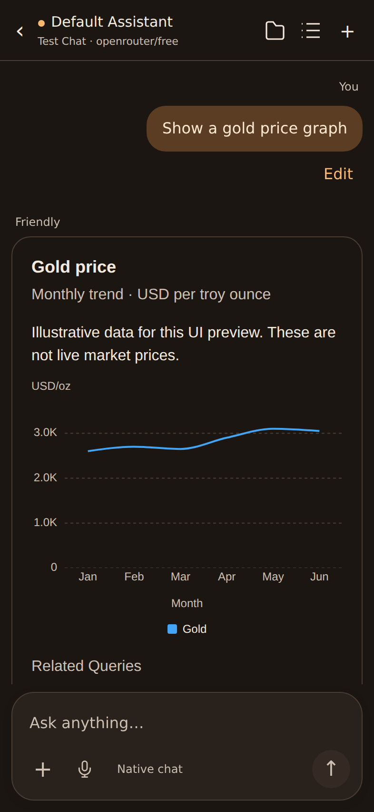
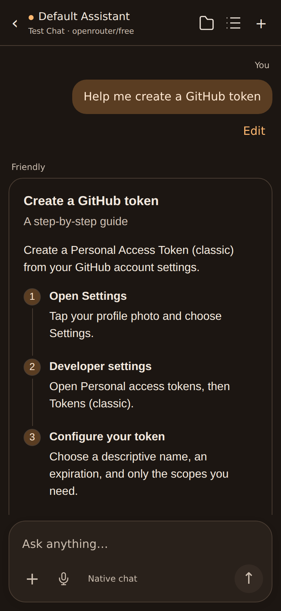

# Issue #14: OpenUI display review

The previous screen could render rich content only if another component supplied
`friendly.openui` metadata. Nothing in chat generation supplied that metadata or
told the model to produce OpenUI, so ordinary replies stayed Markdown and graph
requests could end up running Python instead of displaying a chart.

This change generates the presentation prompt from the exact OpenUI library
bundled with the app, adds it only to chat requests when OpenUI mode is selected,
and renders programs directly from streamed assistant text. Legacy metadata and
ordinary Markdown replies remain supported. The original demo's component
library supplies cards, charts, step guides, tables, forms and follow-ups.

The native toolbar from the issue comment remains above the WebView: assistant,
chat/model details, back, folder, chat options and new chat. Chat options opens
the native preview; the empty home screen also remains native. The duplicate
web header is removed, and the composer uses one rounded input surface with its
actions below the text. The active Friendly theme supplies the colors.

Rich follow-ups and form submissions use the existing native send action. Links
open through the native link handler. The renderer does not execute tools itself;
tool execution stays in the existing Android generation loop. Invalid rich
responses show a source/retry fallback. Existing Markdown conversations are not
retroactively converted; regenerate an answer in OpenUI mode to get rich output.

## Review mockups

These are Chromium screenshots of the **built Android web assets** with fixture
messages, not screenshots from an Android device. The toolbar is a simulated
representation of the retained Compose toolbar. Chart values are explicitly
illustrative. The actual toolbar implementation is retained in `ChatPage.kt`.

| Chart, dark | Steps, dark |
|---|---|
|  |  |

[Chart, light mobile](chart-light-mobile.png) · [Chart, light desktop](chart-light-desktop.png)

UI approval is required before merging into `friendly-2.0` under the repository's
`AGENTS.md`. This work is prepared on `fix/14-openui-display` for review.

## Validation

- `pnpm typecheck`, `pnpm test`: 15 frontend tests passed.
- `pnpm build`: production assets and matching presentation prompt regenerated.
- `./gradlew --max-workers=2 :app:testNightlyDebugUnitTest --tests '*OpenUi*' :app:compileNightlyDebugKotlin`: Android compile and 5 OpenUI tests passed.
- Browser checks against the production bundle: charts, steps, actual form
  submission values, Markdown links, follow-up/send/stop bridge actions, invalid
  response fallback, and layouts at 320, 393, 768 and 1280 px.

No live model/provider request or Android device installation was performed.
Whether a particular model produces valid components remains model-dependent;
the renderer retains a readable fallback for malformed output.

To repeat the browser checks, install Python Playwright and Chromium in your
development environment, then run from the repository root:

```sh
python web/openui/scripts/verify-browser.py
```

The script serves the bundled assets on an ephemeral localhost port and refreshes
the mockups above. Set `PLAYWRIGHT_CHROMIUM_EXECUTABLE` to use an existing Chromium.

Reference: [upstream OpenUI demo and generation route](https://github.com/thesysdev/openui/tree/main/docs/app/chat),
[upstream API route](https://github.com/thesysdev/openui/blob/main/docs/app/api/chat/route.ts).
